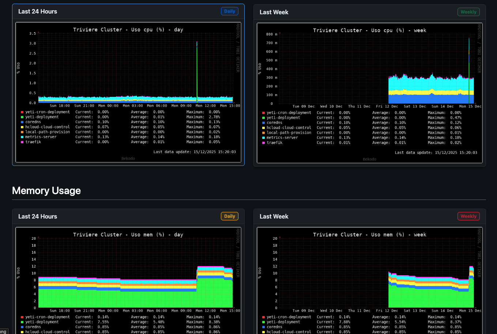

# Kubernetes RRD Monitor


**Monitor de métricas ligero para clusters Kubernetes que genera gráficas históricas de CPU, Memoria y Tráfico.**

Este proyecto ofrece una solución mínima y robusta para visualizar el estado de un cluster Kubernetes sin la complejidad de mantener un stack completo de Prometheus + Grafana. Utiliza **RRDtool** (Round Robin Database) para almacenar métricas y generar gráficas estáticas (PNG) que se sirven a través de un dashboard web simple y ligero.

### Características Principales
- **Ligero y Eficiente**: Consume muy pocos recursos (CPU/RAM).
- **Histórico Persistente**: Gráficas de último día y última semana para CPU, Memoria y Red.
- **Sin Dependencias Externas**: No requiere bases de datos externas ni configuraciones complejas.
- **Seguro**: Acceso protegido mediante Autenticación Básica (Nginx).
- **Stand-alone**: Funciona como un único StatefulSet autónomo.

### Dashboard


## Arquitectura

El sistema se ejecuta dentro del cluster y consta de los siguientes componentes integrados en un `StatefulSet`:

1.  **Recolección de Datos (Worker)**:
    - Un script en **Python** se ejecuta periódicamente (via Cron) cada 5 minutos.
    - Consulta la API de Kubernetes para obtener métricas de Nodos (CPU/RAM).
    - Consulta el endpoint de métricas de **Traefik** (si está disponible) para tráfico de red.
    - Almacena los datos en ficheros `.rrd`.

2.  **Generación de Gráficas**:
    - Tras cada recolección, un script shell utiliza `rrdtool graph` para renderizar archivos PNG actualizados.
    - Se generan vistas diarias y semanales.

3.  **Frontend (Nginx)**:
    - Un servidor Nginx ligero sirve el dashboard HTML estático y las imágenes generadas.
    - Maneja la autenticación de usuarios (Basic Auth).
    - Expone el servicio via Service/Ingress.

4.  **Persistencia**:
    - Un volumen persistente (`PVC`) asegura que los ficheros de base de datos RRD sobrevivan a reinicios del pod, manteniendo el histórico de datos.

## 1. Prerrequisitos
- Cluster Kubernetes.
- `kubectl` configurado.
- Docker para construir la imagen.

## 2. Construcción de la Imagen
Si realizas cambios en el código (`get_metrics_cluster.py`, `rrd_grapher.sh` o `index.html`), debes reconstruir la imagen.

```bash
# Define tu registry
export REGISTRY="[usuario_dockerhub]"

# Construir y subir (desde la raíz del proyecto)
docker build --platform linux/amd64 -t $REGISTRY/kubernetes-rrd-monitor:latest -f docker/Dockerfile .
docker push $REGISTRY/kubernetes-rrd-monitor:latest
```

## 3. Generar Credenciales (Basic Auth)
El acceso web está protegido. Debes generar un secreto con el usuario y contraseña deseados.

1. **Generar hash de contraseña (htpasswd)**:
   Si tienes `htpasswd` instalado (apache2-utils):
   ```bash
   htpasswd -n -b -B miusuario mipassword
   # Salida ejemplo: miusuario:$2y$05$G...
   ```
   
   O usando Docker si no quieres instalar nada:
   ```bash
   docker run --rm -it httpd:alpine htpasswd -n -b -B miusuario mipassword
   ```

2. **Codificar en Base64**:
   Copia la cadena de salida del paso anterior y codifícala en base64:
   ```bash
   echo -n 'miusuario:$2y$05$G...' | base64
   ```

3. **Actualizar el Secreto**:
   Edita el archivo `kubectl/07-secret.yaml` y pega el resultado en la clave `.htpasswd`:
   ```yaml
   apiVersion: v1
   kind: Secret
   metadata:
     name: rrd-basic-auth
     namespace: rrd-monitor
   type: Opaque
   data:
     .htpasswd: <TU_CADENA_BASE64_AQUI>
   ```

## 4. Despliegue en Kubernetes

El orden de aplicación es importante:

### 1. Infraestructura y Configuración
```bash
# Crear Namespace y ConfigMap (Dashboard HTML)
kubectl apply -f kubectl/06-configmap.yaml

# Servicio para Métricas de Traefik (Puerto 9100)
kubectl apply -f kubectl/09-traefik-metrics-service.yaml

# Cuentas de Servicio y Roles (RBAC)
kubectl apply -f kubectl/00-serviceaccount.yaml
kubectl apply -f kubectl/01-clusterrole.yaml
kubectl apply -f kubectl/02-clusterRoleBinding.yaml

# Secretos y Configuración Nginx
kubectl apply -f kubectl/07-secret.yaml
kubectl apply -f kubectl/08-nginx-config.yaml
```

### 2. Aplicación
```bash
# Servicio Interno
kubectl apply -f kubectl/05-service.yaml

# StatefulSet (La aplicación en sí)
kubectl apply -f kubectl/04-StatefulSet.yaml
```

### 3. Acceso Externo (Ingress)
Integrado bajo `tudominio.com/rrd`.
```bash
kubectl apply -f kubectl/03-ingress.yaml
```

## 5. Descripción de Archivos

| Archivo | Descripción |
|---------|-------------|
| `00-serviceaccount.yaml` | ServiceAccount para los permisos del pod. |
| `01-clusterrole.yaml` | Roles con permisos para leer métricas del clúster. |
| `02-clusterRoleBinding.yaml` | Asocia el ServiceAccount con el ClusterRole. |
| `03-ingress.yaml` | (Opcional) Configuración de Ingress para acceso externo. |
| `04-StatefulSet.yaml` | Definición principal de la carga de trabajo (Nginx + Worker Python). |
| `05-service.yaml` | Servicio para exponer la aplicación internamente. |
| `06-configmap.yaml` | Configuración HTML y scripts. |
| `07-secret.yaml` | Credenciales para autenticación básica (Basic Auth). |
| `08-nginx-config.yaml` | Configuración específica de Nginx. |
| `09-traefik-metrics-service.yaml` | Servicio para métricas de Traefik (si aplica). |

## 6. Verificación y Logs

Verificar que los pods están corriendo:
```bash
kubectl get pods -n rrd-monitor -w
```

Ver logs del generador de gráficas:
```bash
kubectl logs -n rrd-monitor rrd-sts-0 -c worker
```

Acceso local rápido (Port Forward):
```bash
kubectl port-forward -n rrd-monitor sts/rrd-sts 8080:80
# Abrir en navegador: http://localhost:8080
```

## 7. Solución de Problemas

- **Permisos RBAC**: Si ves errores de "Forbidden" en los logs del worker, verifica que el `ClusterRole` y `ClusterRoleBinding` se hayan aplicado correctamente.
- **Volúmenes**: Si el pod se queda en `ContainerCreating`, revisa que tu clúster tenga un StorageClass por defecto o que el PVC se pueda provisionar correctamente.